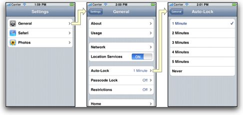

# NavigationGroup Widget Sample

The **NavigationGroup** widget provides a cross-platform version of the iOS [NavigationGroup](http://http://docs.appcelerator.com/titanium/latest/#!/api/Titanium.UI.iPhone.NavigationGroup). The NavigationGroup provides a way to manage hierarchical content. On iOS, the built-in NavigationGroup control is used.



On Android, the windows are managed in a stack and the system back button is used to go back in the content.

##Manifest
* Version: 1.0 (stable)
* Github: https://www.github.com/orthlieb/widget_navigationgroup
* License: [Apache 2.0](http://www.apache.org/licenses/LICENSE-2.0.html)
* Author: Carl Orthlieb
* Supported Platforms: iOS (iPhone/iPad), Android

## Adding the NavigationGroup Widget to Your Alloy Project

* In your application's config.json file you will want to include the following line in your dependencies:

```
"dependencies": {
    "com.orthlieb.navigationgroup":"1.0"
}
```

*  Create a widgets directory in your app directory if it doesn't already exist.
*  Copy the widget_navigation/widgets/com.orthlieb.navigationgroup folder into your app/widgets directory. 

## Create a NavigationGroup in the View
You can add a NavigationGroup to a view by *requiring* the NavigationGroup widget. 

	<Widget id="navgroup" src="com.orthlieb.navigationgroup"/>

Assign it an ID that you can use in your controller. E.g. `id="navgroup"` You can now access the NavigationGroup via `$.navgroup` in your controller. 

## Accessible Properties and Methods
| Name | Type | Description | 
| ---- | ---- | ----------- |
| [open](#open) | *method* | Opens a window on the stack. |
| [back](#back) | *method* | Closes the topmost window on the stack. |
| [home](#home) | *method* | Goes back to the first window on the stack, closing all other windows in the reverse order in which they were added. |
| [top](#top) | *TiUIWindow* | Returns the topmost window on the stack. |
| [length](#length) | *integer* | Returns the number of windows on the stack. |

### [open(windowToOpen, options)](id:open)
To use the NavigationGroup you add to the window stack through the open method. 

| Parameter | Type | Description |
| --------- | ---- | ----------- |
| windowToOpen | [TiUIWindow]() | Window to open within the nav group. |
| [options] | [openWindowParams](http://docs.appcelerator.com/titanium/latest/#!/api/openWindowParams) | Options to apply while opening. |

For example:

```
var win1 = Alloy.createController('win1').getView();
$.navgroup.open(win1);
Alloy.Globals.navGroup = $.navgroup;
```

It's recommended that you cache the NavigationGroup in the Alloy globals for use in other windows on the stack so that they can open additional windows.

### [back(options)](id:back)
Used to close the topmost window in the Navigation Group. Normally, the `back()` functionality is handled for you through the hardware back button on Android and the back button in the title bar on iOS. If you want to force a back() programmatically you can call the back() method.


| Parameter | Type | Description |
| --------- | ---- | ----------- |
| [options] | [*Ti.UI.Animation*](http://docs.appcelerator.com/titanium/latest/#!/api/Titanium.UI.Animation) | Animation dictionary or animation to apply when closing the window. |
| Returns | *boolean* | *true* if there was a window to close and *false* if the home or first window has been reached. |

For example, you could call this method from a back button in your window.

view:

```
<Alloy>
	<Window id="win1">
        <Button onClick="ButtonClick">Back</Button>
	</Window>
</Alloy>
```

controller:

```
function ButtonClick(e) {
    Alloy.Globals.navGroup.back();
}
```

### [home()](id:home)
Go back to the first window of the NavigationController, closing windows in the reverse order that they were put on the stack.

| Parameter | Type | Description |
| --------- | ---- | ----------- |
| [options] | [*Ti.UI.Animation*](http://docs.appcelerator.com/titanium/latest/#!/api/Titanium.UI.Animation) | Animation dictionary or animation to apply when closing the window. |
| Returns | *boolean* | *true* if there was a window to close and *false* if the home or first window has been reached. |

For example, you could call this method from a home button in your window.

view:

```
<Alloy>
	<Window id="win1">
        <Button onClick="ButtonClick">Home</Button>
	</Window>
</Alloy>
```

controller:

```
function ButtonClick(e) {
    Alloy.Globals.navGroup.home();
}
```

### [top](id:top)
Returns the topmost window on the stack. For example, you could set the title in the topmost window.

```
Alloy.Globals.navGroup.top.title = "Topmost Window";
```

### [length](id:length)
Returns the topmost window on the stack. 

## Events
The NavigationGroup issues events that you can hook into using that standard Alloy *on* method.

| Event | Triggered |
| ----- | --------- |
| open | Emitted when a window is opened in the navigation group. |
| close | Emitted when a window is closed in the navigation group. |

Example:

```
Alloy.Globals.navGroup.on("close", function (e) {
	alert("Window closed.", e.source.title2hot))
```

## Future Work

* Support for other platforms like Mobile Web and Blackberry.


